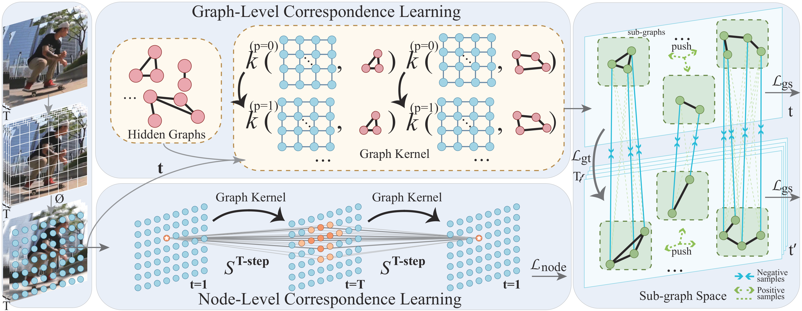

# HiGraph

Code for our paper: Reformulating Graph Kernels for Self-supervised Space-Time Correspondence Learning



## Installation
Our HiGraph depends on PyTorch, MMCV, MMAction2. Below are quick steps for installation. Please refer to install.md for more detailed instruction.

```shell
conda create -n open-mmlab python=3.8 pytorch=1.10 cudatoolkit=11.3 torchvision -c pytorch -y
conda activate open-mmlab
pip3 install openmim
mim install mmcv-full
mim install mmaction  
cd higraph
pip3 install -e .
```

## Dataset
You need to download Kinetics400, DAVIS, YouTube-VOS, VIP, JBHMI, and YouTube-VIS datasets.
You can also download from Academic Torrents (kinetics400 with short edge 256 pixels are available) and cvdfoundation/kinetics-dataset
For Kinetics400, we extract frames there for better I/O performance with denseflow.
```shell
bash extract_rgb_frames.sh ${DATASET}
```
you can run the follow scripts to generate file list in the format of videos and rawframes, respectively.
```shell
bash generate_videos_filelist.sh ${DATASET}
# execute the command below when rawframes are ready
bash generate_rawframes_filelist.sh ${DATASET}
```
In the context of the whole project (for Kinetics only), the minimal folder structure will look like: (minimal means that some data are not necessary: for example, you may want to evaluate kinetics using the original video format.)
```shell
HiGraph
├── tools
├── configs
├── data
│   ├── ${DATASET}
│   │   ├── ${DATASET}_train_list_videos.txt
│   │   ├── ${DATASET}_val_list_videos.txt
│   │   ├── annotations
│   │   ├── videos_train
│   │   ├── videos_val
│   │   │   ├── abseiling
│   │   │   │   ├── 0wR5jVB-WPk_000417_000427.mp4
│   │   │   │   ├── ...
│   │   │   ├── ...
│   │   │   ├── wrapping_present
│   │   │   ├── ...
│   │   │   ├── zumba
│   │   ├── rawframes_train
│   │   ├── rawframes_val

```
## Training
You can use the following command to train a model.
```shell
python tools/train.py configs/recognition/ssl/higraph_r18_1x1x8_50e_kinetics400_rgb.py 4 \
    --work-dir work_dirs/higraph_r18_1x1x8_50e_kinetics400_rgb \
    --validate --seed 0 --deterministic
```
## Evaluation: Label Propagation
To evaluate a trained model on the DAVIS task, clone the davis2017-evaluation repository, and prepare the data by downloading the 2017 dataset and modifying the paths provided in eval/davis_vallist.txt. Then, run:
```shell
python tools/test.py configs/recognition/ssl/higraph_r18_1x1x8_50e_kinetics400_rgb.py 4 \
--filelist /path/to/davis/vallist.txt \
--model-type imagenet18 --save-path /save/path \
--topk 10 --videoLen 20 --radius 12  --temperature 0.05  --cropSize -1
```
### Post-Process:
```shell
# Convert
python eval/convert_davis.py --in_folder /save/path/ --out_folder /converted/path --dataset /davis/path/

# Compute metrics
python /path/to/davis2017-evaluation/evaluation_method.py \
--task semi-supervised   --results_path /converted/path --set val \
--davis_path /path/to/davis/
```

# Acknowledge
```shell
@inproceedings{jabri2020walk,
    Author = {Allan Jabri and Andrew Owens and Alexei A. Efros},
    Title = {Space-Time Correspondence as a Contrastive Random Walk},
    Booktitle = {Advances in Neural Information Processing Systems},
    Year = {2020},
}
```

```shell
@inproceedings{nikolentzos2020random,
  title={Random Walk Graph Neural Networks},
  author={Nikolentzos, Giannis and Vazirgiannis, Michalis},
  booktitle={Proceedings of the 34th Conference on Neural Information Processing Systems},
  pages={16211--16222},
  year={2020}
}
```
